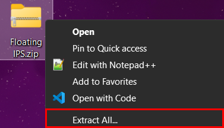
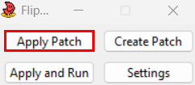

# How To Setup a Super Mario 64 Mod # 
This is a Guide on how to setup most Super Mario 64 Mods on an Emulator on Windows.

## Preparations ##
To get this to work you need the following things already:
* An Emulator setup to play the Game (Examples: Project64, Mupen64Plus, Parallel Launcher)
  * Project64: https://www.pj64-emu.com/
  * Mupen64Plus: https://mupen64plus.org/
  * Parallel Launcher: https://parallel-launcher.ca/
* Floating IPS to patch the ROM: https://www.smwcentral.net/?p=section&a=details&id=11474
* A Mario 64 ROM (US Version) --> I can't tell you where to get that
* The Patch file to create the Mod --> .bps File of the Mod you're trying to create

## Patching the ROM ##
After having the Game with an Emulator setup and the Patch File and Floating IPS downloaded, follow these steps:

1. Unzip the .Zip Folder of Floating IPS:  

2. Open the file "flips.exe" in the newly unzipped folder and click on "Apply Patch":  

* First select the Patch (.bps) File
* Then select the Mario 64 (US Version) ROM
* And at last define a name of how the newly created (patched) ROM should be called

3. Now you can use the new ROM to play the Mod on the Emulator of your choice :D
